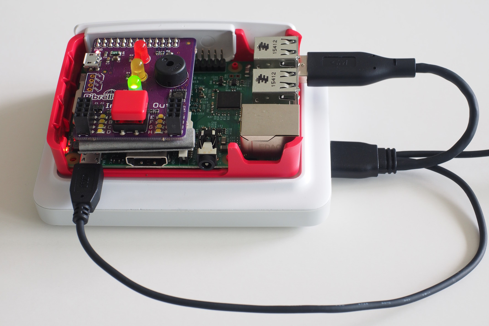

Raspberry Pi Imagetank
======================

What it is
----------

The imagetank is a backup solution for images based on a Raspberry Pi.
The basic idea is that you plug in your SD-card from your camera into the
Pi (using an USB adapter), and the Pi will automatically copy all
images to an attached HDD/SDD.

Since this is a headless system, the user interface has to be simple. The
imagetank uses an extension board called "Pibrella", which is
manufactured by Pimoroni. This board has a number of LEDs which we
use to signal state and a button, which we use for shutdown.

Basic installation
------------------

Installation is quite simple. Grab the current version of
Raspbian-Jessie-Lite and install it to an micro SDHC card. Configure
the system to taste. Additionally install the package `rsync`:

    sudo apt-get update
    sudo apt-get install rsync

Then attach an external usb-disk, and execute the following command:

    sudo fdisk /dev/sda

If the disk is already partitioned, you should first delete all existing
partitions. Use the `p`-command (`print`) to check for existing partitions
and the `d`-command to delete them. Once the print-command does not show any
partitions anymore, create a new one with `n`. You can accept all defaults,
this will create a single partition which takes up all available
space. Leave the fdisk-program with the `w`-command (`write`). This
will erase all data already on the disk, so make sure you don't loose
any important data.

Next, you should format the partition, create a mount-point and
mount the partition:

    sudo mkfs.ext4 /dev/sda1
    sudo mkdir /data
    sudo mount /dev/sda1 /data

All space is now available in the `/data`-directory. Since the mount
is temporary, you should now open the file `/etc/fstab` with your
favorite editor andd add the following line

    /dev/sda1 /data ext4 user_xattr,noatime,acl 1 2

Reboot and check with the `df`-command that the external drive is
mounted and the space is available.

If you are a Linux-user you can automate all the above steps. For
details, see below (section "Automatic installation of Raspbian
to a hard-disk").

Install specific imagetank files
--------------------------------

All necessary files are below the `files`-directory of this project.
To copy the files, clone the project and copy the files:

    sudo su -
    git clone https://github.com/bablokb/pi-imgtank.git
    cd pi-imgtank
    rsync -avz files/ /
    exit

This will install an udev-rule which will automatically call the
script `/usr/local/sbin/copy_img` on plugin of a SD-card. It will
also install two system-services which control the Pibrella-HAT.

To activate these system-services, run the following commands:

    sudo systemctl enable endofboot.servcie
    sudo systemctl enable hat-pibrella-service

Operation
---------

Now shut down and if not already done, install the Pibrella extension. If
you now reconnect power you should see the red led blinking for a few
seconds. After that, the red turns off and the green led turns on. The
system is now ready.

Insert a SDHC card from your digital camera into an USB-adapter and plug
it into the Pi. The orange led should now start to blink slowly. After all
files are copied, the led stops blinking and the green led comes on again.
Now it is safe to remove the USB-adapter.

The leds of the Pibrella hat always reflects the current state of the
system. You can see a  graphical representation of the various states in
the following image.

Automatic installation of Raspbian to a hard-disk
-------------------------------------------------

The preparation of a hard-disk as described above is not very complicated,
but it can be fully automated. As an added benefit, also the operating
system runs from the disk. This will use the micro SDHC only for booting
and will certainly extend the lifetime of the card.

On a Linux sytem, download the git-project called `apiinst`

    git clone https://github.com/bablokb/apiinst.git

Now attach your micro SDHC card to your PC (we will assume it uses
`/dev/sdb`) and then attach your hard-disk to the PC. In our example
it will use `/dev/sdc`. Please make sure that these device names
are correct, else you will risk loosing all your data on your PC. Existing
data on the devices will always be deleted.

To install Raspbian and prepare a data-partition on the disk, just run

    sudo apiinst/bin/apiinst -i /path/to/20160527-raspbian-jessie-lite.zip \
         -B /dev/sdb -t /dev/sdc -D 150G

Adapt the size of the data-partition (option `-D`) to your needs. The
command above will add all remaining space to the root-partition of the
system.
